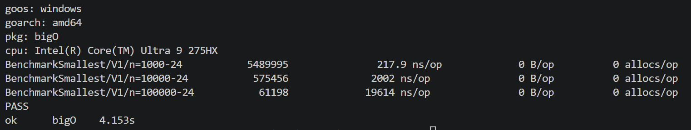
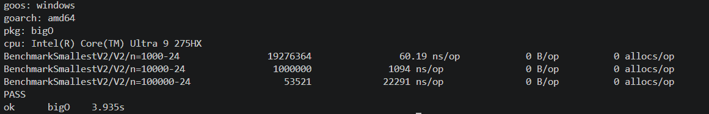
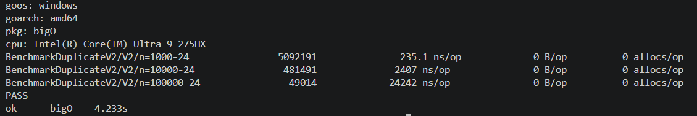
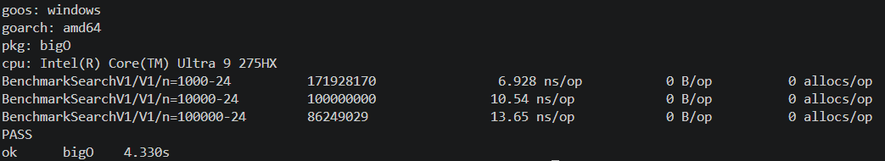
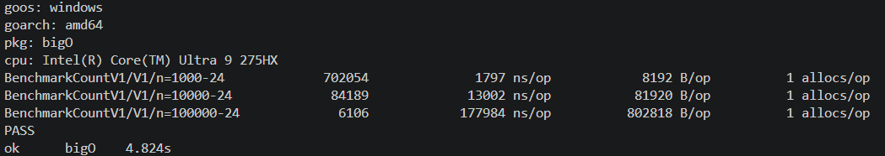

# TP - Complexité algorithmique en GO 
------------------------------------- 

lien github : https://github.com/Juuuules83/tp-kaplas.git 

------------------------------------- 

## PB01 - Le plus petit kapla : 

### Question : et si la pile était déjà rangée, quelle serait la complexité ? 

voici le résultat du benchmark V1  
->  

voici le résultat du benchmark V2  
->  

nous sommes à un nombre d'opération de O(n) dans le pire cas 
en raison du fait que c'est un slice que l'on parcours,  
en revanche, la V2 permet de faire en sorte que si min est égal à 1 le programme s'arrête de parcourir le slice car "1" est le plus petit nombre possible 

Nous ne pouvons pas dans la grande majorité des cas réduire à O(1), car le slice doit parcourir "n" nombre en fonction du nombre d'éléments présent dans le slice. 
En revanche pour la V2, dans le cas où "1" serait le premier nombre du slice, donc que le slice est déjà ranger ou qu'il commence simplement par 1, cela serait bien O(1) 

**Commande pour lancer le bench V1 :** _go test -bench=SmallestV1 -benchmem -run='^$'_ 
**Commande pour lancer le bench V2 :** _go test -bench=SmallestV2 -benchmem -run='^$'_ 

-------------------------------------- 

## PB02 - Le Kapla en double : 

###  Question : si la pile contenait des numéros quelconques, laquelle de vos  versions fonctionnerait encore ?  

voici le résultat du benchmark V1 
->   

voici le résultat du benchmark V2 
->  

 - Pour la version V1, O(n) on constate que la mémoire utilisée augmente proportionnellement à la valeur de "n",  
cela passe d'environ 50 142 B/op pour 1000 éléments à plus de 4 632 566 B/op pour 100 000 éléments. 
La V1 fonctionnerait encore avec des numéros quelconques, car elle vérifie simplement si un numéro a déjà été rencontré. 

 - Pour la version V2, O(1) on constate que la mémoire utilisée reste constante à 0 allocs/op peu importe que "n" soit petit ou grand. 
 La V2 ne fonctionnerait plus avec des numéros quelconques, car elle utilise la formule de la somme des nombres de 1 à n.  
 Elle dépend donc du fait que la pile contienne tous les numéros de 1 à n avec un seul doublon. 

**Commande pour lancer le bench V1 :** _go test -bench=DuplicateV1 -benchmem -run='^$'_  
**Commande pour lancer le bench V2 :** _go test -bench=DuplicateV2 -benchmem -run='^$'_ 

-------------------------------------- 

## PB03 - La hauteur de la tour :  

### Question : retrouvez-vous l'écart mesuré pendant la capsule ? Sinon, cherchez  pourquoi. 
Voici le resultat du Benchamrk V1 
->  

voici le résultat du benchmark V2 
->  

 - Pour la version V1 O(n), on constate que le temps d'excution augmente de manière proportionnelle à la valeur de "n",  
cela passe d'environ 230.9 ns/op pour 1000 éléments à plus de 24002 ns/op pour 100 000 éléments   

- pour le version V2 O(1), on constate que le temps d'excution reste constant d'environ 0.1240 ns/op peu importe que "n" soit petit ou grand  

**Commande pour lancer le bench V1 :** _go test -bench=TowerHeightV1 -benchmem -run='^$'_  
**Commande pour lancer le bench V2 :** _go test -bench=TowerHeightV2 -benchmem -run='^$'_  

-------------------------------------- 

## PB04 - Retrouver un Kapla dans une ligne rangée :  

### Question : si la ligne n'était pas rangée, vaudrait-il la peine de la trier en O(n logn) pour une seule recherche ? Et pour 10 000 recherches ? 
Voici le resultat du Benchamrk V1 
->  

 - la complexité est de O(n), car le programme parcourt la ligne jusqu'à trouver le numéro recherché. 
 le numéro recherché est n+1, donc il n'est pas présent dans la ligne. Le programme doit donc parcourir toute la ligne. 

Pour une seule recherche, ça ne vaut pas le coup de trier la ligne, le tri en O(n log n) coûte plus cher qu'une simple recherche. 
Pour 10 000 recherches, oui ça peut être bien de trier une seule fois pour les recherches suivantes. 

**Commande pour lancer le bench V1 :** _go test -bench=SearchV1 -benchmem -run='^$'_  

-------------------------------------- 

## PB05 - Compter les Kaplas par numéro :  

### Question : si le plafond restait fixé à 10, quelle serait la complexité de votre V1 ? Pourquoi ? 
Voici le resultat du Benchamrk V1 
->  

 - La complexité est de O(n). On constate que le temps d'exécution augmente lorsque la valeur de "n" augmente.
Cela passe d'environ 1 797 ns/op pour 1 000 éléments à 177 984 ns/op pour 100 000 éléments. 

La mémoire utilisée augmente avec "n", car le programme crée un nouveau slice de taille "plafond + 1". 
Si le plafond restait fixé à 10, la complexité resterait O(n), car le programme doit parcourir tous les éléments de la pile.  

**Commande pour lancer le bench V1 :** _go test -bench=CountV1 -benchmem -run='^$'_  